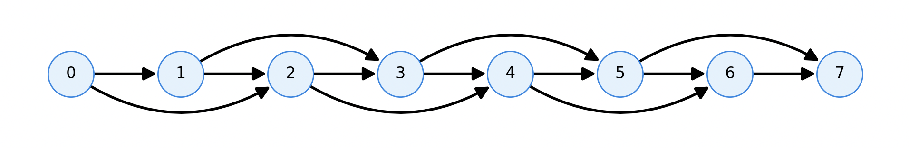

+++
date = '2026-01-05T15:41:17+05:30'
draft = false
title = 'DSA: Part 1 - Dynamic Programming'
series = ['dsa']
series_order = 1
+++

Dynamic programming always struck me as an incredibly contrived solution to certain problems. 
Often, I would unsuspectingly try to reason about some problem and build some sort of recursive/brute-force approach, concluding that this *must be* the optimal solution, only to be hit with TLE on any non-trivial testcases. 
Upon looking at the solutions, I would be met again with the familiar yet indecipherable `dp` tables, until I just resolved to build a **formal understanding** of what DP entails and how to apply it myself.

## DAGs
One thing that would have helped me *immensely* would have been an understanding of a substructure common to **every problem** where DP is applicable - the DAG (*Directed Acyclic Graph*).
Once I understood what this amalgamation of technical jargon *actually meant*, I was able to sniff out DP solutions much more succesfully.

The 3 parts each tell you something about what it is:
1. **directed** - one vertex may connect to another vertex but not the other way round. In other words, the edge `A -> B` existing doesn't imply the existence of `B -> A`.
2. **acyclic** - a cycle is any path on a graph that takes you from the start back to the start, and every vertex *other than the start* is visited a maximum of one time.
3. **graph** - [a data structure](https://web.cecs.pdx.edu/~sheard/course/Cs163/Doc/Graphs.html) which represents objects (vertices/nodes) and their relationships (edges/connections).

### Visualisation
Imagine some nodes gathered into a line.
You can **only make connections** from a node on the line to a **node on its right**.
Following these rules, you can produce **any DAG** imaginable.


### Application
Let's look at an example to understand what DAGs represent in the context of DP.

#### Climbing Stairs
- There are `n` steps in front of you. 
- You can climb 1 or 2 steps at a time. 
How many unique paths up the stairs are there?

In solving a dynamic programming problem, you will define a **DP state**.
In this case, to figure out how many ways to climb `n` steps, we will need to know the number of ways to climb `i` steps where `0 <= i <= n`
This is a leap of faith for now, but later I'll explain how this works.
Let's look at a diagram representing the situation for `n=7`:


The vertices (nodes) each represent a certain DP state (*how many ways are there to climb `i` nodes*)?
The edges each represent what each DP state uses to calculate its value.

E.g. for `dp(7)` you'll notice that nodes 5 and 6 connect to it.
To reach stair 7 (the top of the staircase), you will **have to go through step 5 or step 6**.
Therefore, the number of ways to climb 7 steps is equal to the number of ways to climb 5 steps added to the number of ways to climb 6 steps.
In other words, `dp(7) = dp(6) + dp(5)`. It holds, in general, that every `dp(i) = dp(i - 1) + dp(i - 2)` for `i >= 2`. This makes sense - the number of ways to reach a certain step is equal to the number of ways to reach the previous step or the step before that (as those are the **only steps** from which which we can reach the desired one).

This being a DAG gives this some special properties - it means that there is some order in which we can traverse these states that means we'll already have computed all the results we'll need to compute a future DP result (this dependency resolution is known as a topological ordering) and one of the properties of a DAG is that it is the only type of graph that can be topologically ordered in this way.
Some of the states, (namely `dp(0)` and `dp(1)`) aren't able to be calculated in this way, so we simply special-case their values - `dp(0) = dp(1) = 1`. These are known as `base cases`.

### Implementation
```python
def climb_stairs(n):
```

Create an empty DP table where `dp[i]` means the number of ways to climb step `i`. and add base cases:
```python
    dp = [0] * (n + 1)
    dp[0] = dp[1] = 1
```

Then, we'll iterate in this topological ordering (from 2 to `n` inclusive)
and use our formula for calculating the DP in terms of the previously computed values.
Also, return `dp[n]` (the number of ways to climb `n` stairs)
```python
    for i in range(2, n + 1):
        dp[i] = dp[i - 1] + d[i - 2]

    return dp[n]
```

Putting it all together:
```python
def climb_stairs(n):
    dp = [0] * (n + 1)

    for i in range(2, n + 1):
        dp[i] = dp[i - 1] + dp[i - 2]

    return dp[n]
```
