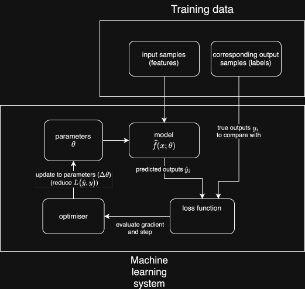
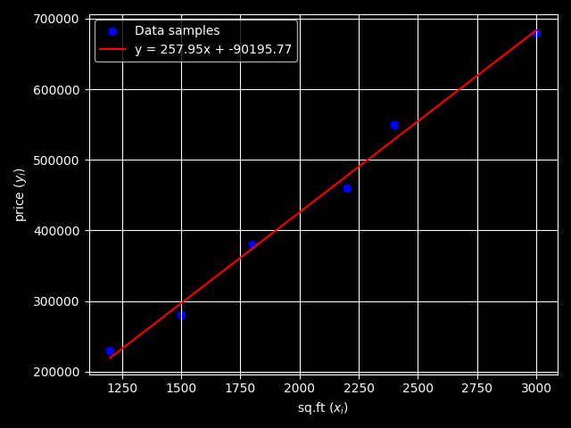

+++
date = '2026-04-03T18:03:04+01:00'
draft = false
math = true
title = 'Machine Learning: Part 1 - Foundations'
+++

## Why?
For years, we've gotten by with hard-coded, "traditional" software. What benefit does machine learning provide?

Imagine, for example, you're building an e-mail platform, and you want to introduce a **spam-filtering feature**. 
Maybe you begin by checking for common words seen in spams, e.g. *"FREE", "DISCOUNT", "LIMITED-TIME"* - simple enough, a couple `if` statements and you're done.
Then, someone receives an email - *"Hey, are you free tomorrow for the meeting?"*, and the system falsely flags the email.
After receiving some complaints from users, you might begin to add some more complex heuristics, checking against databases, running computationally expensive procedures... Soon enough, you're wading through a convoluted mess of regexes and checks that are costing your company time and money, yet it still isn't exhaustive. You realise that this is a futile pursuit. 

The number of possible emails is unfathomably large, and for all intents and purposes, this function is **impossible to fully specify**. Consequently, we turn to machine learning - for many real-world applications, we don't need *perfect, provably correct and rigorous solutions*, just something that works.

## The Learning Problem
Simply put:
> The fundamental problem that machine learning aims to solve is *approximating a function*, given a list of inputs (**features**) and their respective outputs (**labels**).

At first, this might seem trivial, or very abstract - but consider that tasks such as classifying images, weather prediction, and text generation, all fit this mold:
| Task | Input | Output |
| --- | --- | --- |
| Image classification | Image (array of pixels) | Image category |
| Weather prediction | Historical weather data | Temperature forecast |
| Text generation | Context | Next token |

Despite there being caveats to this, essentially any task that can be reframed like this becomes approachable with ML; it is an extraordinarily powerful, general tool.

## How?
Right out the gate, we'll begin by defining key parts of a machine learning system.
1. **task**: the problem to solve
2. **model**: the sequence of computations to perform
3. **loss**: a metric of *how badly* the model performs, given the model output and the correct output
4. **optimiser**: a method of tuning the model to perform better

Under all of the jargon, it's pretty simple. Now, to formalise these ideas:

### The Mathematical Lens
We know that some function \(f : X \to Y\) exists; our task is to build \(\hat{f}\) which *behaves like* \(f\) on **unseen inputs**, given some samples \((x_i, y_i)\).
To have something to work with, we'll define the structure of \(\hat{f}\) - our **model**. Alternatively, you can think of this as setting out *the family of functions to consider*.
This is one of the places where some intuition and empirical consideration is needed - if too simple, our model fails to truly capture the behaviour of \(f\), but too complex, and we don't generalise to unseen inputs, and waste effort computing.

In practice, once we define our model, e.g. \(\hat{f}(x) = ax^2 + bx + c\), we then alter the behaviour by adjusting the **parameters** of the model. In this example, we have \(a, b, c\) as parameters - each a knob that we can adjust. To begin, we have no idea what these values should be, so we initialise them randomly.

Next, we'll test out our model, by computing \(\hat{f}(x_i)\) for all our sample inputs. This produces a list of predicted outputs, denoted \(\hat{y}_i\).

To optimise our model to produce better outputs, we need something that tells us if a change is an objective improvement. We boil everything down to a **scalar** loss signal - high values indicate low accuracy, and vice versa.

For this purpose, we use a **loss function**, denoted \(L(\hat{y}_i, y_i)\) - both the predicted and actual output are taken in.
One example loss function would be **Mean Squared Error** - \(L(\hat{y}_i, y_i) = \frac{1}{n} \sum_i{(\hat{y}_i - y_i)^2}\).
This has a few nice properties - by squaring each **error** (difference between predicted and actual values), we ensure that larger errors are **punished much more heavily** than small errors, and that errors are **always positive** - no matter whether the predicted value is greater or less than the true value.

In order to improve our model, we update its parameters, in some way, to reduce the loss.
There are different technique for this, including:
- **closed-form solution**: solve for the best parameters directly when a mathematical solution exists.
- **gradient descent (iterative)**: update parameters step by step using gradients; the most common and flexible approach in ML.
- **random search / evolutionary methods**: try many parameter variants and keep the best; used less often, e.g. genetic algorithms



## Example
> A real estate company wants to get an estimate of a house price, given the square footage.

The function we are considering maps a single scalar input to a single scalar output.
In this case, we will use a simple **linear** model - in other words, the family of functions considered is \(\hat{y} = a x_i + b \).
There are 2 parameters - the gradient \(a\) and the y-intercept \(b\).
To build this model, our sample data consists of pairs of square footage and the respective prices, \(x_i, y_i\):
| sq.ft \(x_i\) | price \(y_i\) |
| --- | --- |
| 1200 | 230000 |
| 1800 | 380000 |
| 2400 | 550000 |
| 3000 | 680000 |
| 1500 | 280000 |
| 2200 | 460000 |

For our loss function, let's stick to Mean Squared Error for the reasons we described above, *and* that it lets us derive a closed form solution:
\[
    \begin{align*}
    L(\hat{y}) &= \frac{1}{n} \sum_{i}(\hat{y}_i - y_i)^2 \\
    \text{and } \hat{y} &= ax_i + b \\
    \therefore L(\hat{y}) &= \frac{1}{n} \sum_{i}(ax_i + b - y_i)^2
    \end{align*}
\]

\(L(\hat{y})\) is a positive quadratic, both in terms of \(a\) or \(b\).
Therefore, to minimise \(L(\hat{y})\), set the derivative with respect to \(a\) or \(b\) = 0.

**With respect to b:**
\[
    \begin{align*}
    \frac{\partial L}{\partial b} &= \frac{2}{n} \sum (ax_i + b - y_i) \\
    &= 0 \\
    \sum (ax_i - y_i) + nb &= 0 \\
    b &= \frac{1}{n} \sum (y_i - ax_i)
    \end{align*}
\]

**With respect to a:**
\[
    \begin{align*}
    \frac{\partial L}{\partial a} &= \frac{2}{n} \sum (ax_i + b - y_i) x_i \\
    &= \sum (ax^2_i + bx_i - x_i y_i) \\
    &= \sum ax^2_i + b \sum x_i - \sum x_i y_i \\
    &= a \sum x^2_i + \frac{1}{n} \sum (y_i - ax_i) \sum x_i - \sum x_i y_i \\
    &= a \sum x^2_i - a \frac{1}{n}(\sum x_i)^2 + \frac{1}{n} (\sum y_i)(\sum x_i) - \sum x_i y_i \\
    &= a\left( \sum x^2_i - \frac{1}{n}(\sum x_i)^2 \right) + \frac{1}{n} (\sum y_i)(\sum x_i) - \sum x_i y_i = 0 \\
    a &= \frac{\sum x_i y_i - \frac{1}{n} (\sum y_i)(\sum x_i)}{\sum x^2_i - \frac{1}{n}(\sum x_i)^2}
    \end{align*}
\]

The formulae above *work*, but they don't really give us much of an intuition.
If we use the notation \(\bar{x} = \frac{1}{n} \sum_{i=1}^n x_i\) and \(\bar{y} = \frac{1}{n} \sum_{i=1}^n y_i\), then we can reshuffle things into the form seen in textbooks.

First, let's deal with the numerator of \(a\):
\[
    \begin{align*}
    \sum x_i y_i - \frac{1}{n}(\sum x_i)(\sum y_i)
    &= \sum x_i y_i - n\bar{x}\bar{y} \\
    &= \sum x_i y_i - \bar{x}\sum y_i - \bar{y}\sum x_i + n\bar{x}\bar{y} \\
    &= \sum (x_i - \bar{x})(y_i - \bar{y})
    \end{align*}
\]

And the denominator:
\[
    \begin{align*}
    \sum x_i^2 - \frac{1}{n}(\sum x_i)^2
    &= \sum x_i^2 - n\bar{x}^2 \\
    &= \sum x_i^2 - 2\bar{x}\sum x_i + n\bar{x}^2 \\
    &= \sum (x_i - \bar{x})^2
    \end{align*}
\]

So the slope becomes:
\[
    a = \frac{\sum (x_i - \bar{x})(y_i - \bar{y})}{\sum (x_i - \bar{x})^2}
\]

The intercept \(b\) can also be derived:
\[
    b = \frac{1}{n} \sum (y_i - ax_i) \\
    b = \bar{y} - a\bar{x}
\]

### Implementation
Having derived the formulae for fitting a line to a set of data points (known as **Least Squares Regression**), let's look at an implementation in Python, and contrast it to an iterative gradient-descent approach.
```python
import numpy as np
import matplotlib.pyplot as plt

plt.style.use('dark_background')

"""
| sq.ft (x_i) | price \(y_i\) |
| --- | --- |
| 1200 | 230000 |
| 1800 | 380000 |
| 2400 | 550000 |
| 3000 | 680000 |
| 1500 | 280000 |
| 2200 | 460000 |
"""

# Input data
x = np.array([1200, 1800, 2400, 3000, 1500, 2200])
y = np.array([230000, 380000, 550000, 680000, 280000, 460000])

n = len(x)

x_mean = np.mean(x)
y_mean = np.mean(y)

# y = ax + b
a = (np.sum((x - x_mean) * (y - y_mean))) / np.sum((x - x_mean) ** 2)
b = y_mean - a * x_mean

# Plot the data points and the regression line
plt.scatter(x, y, color='blue', label='Data samples')
x_line = np.linspace(min(x), max(x), 100)
y_line = a * x_line + b
plt.plot(x_line, y_line, color='red', label=f'y = {a:.2f}x + {b:.2f}')
plt.plot(x_mean, y_mean, marker='o', label='Mean')


mean_squared_error = np.mean((y - (a * x + b)) ** 2)
plt.title(f'Linear Regression (MSE: {mean_squared_error:.2f})')

plt.xlabel('sq.ft ($x_i$)')
plt.ylabel('price ($y_i$)')

plt.legend()
plt.grid()
plt.tight_layout()
plt.savefig('Linear_Regression_Plot.png')
```

