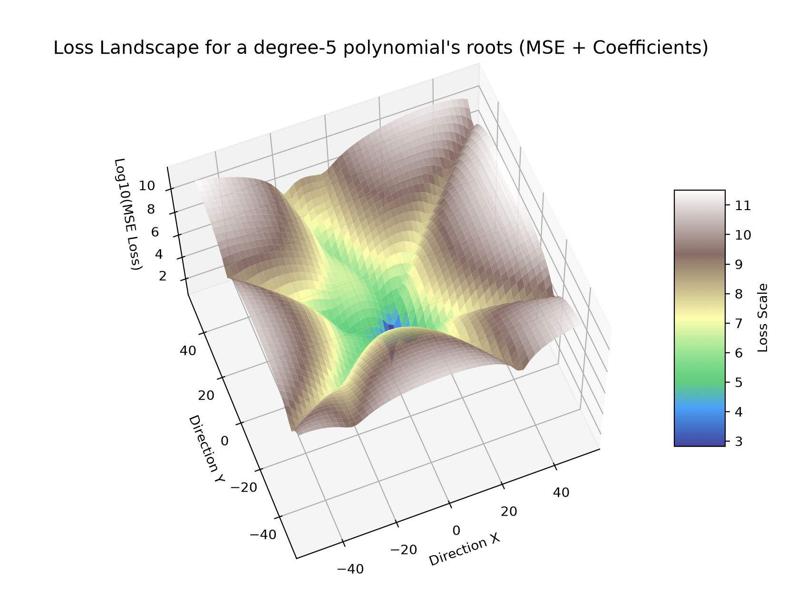
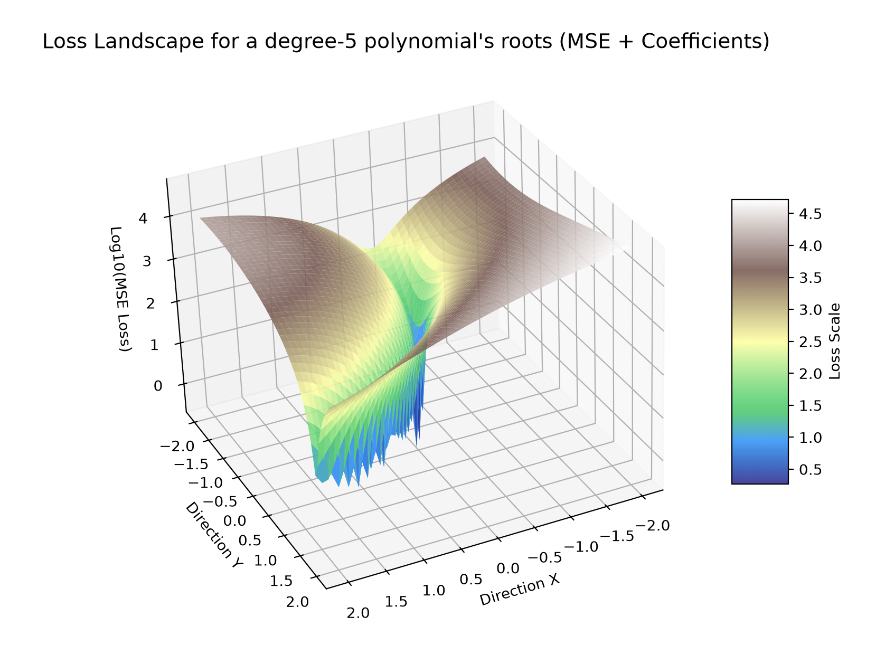

+++
date = '2026-06-18T20:55:32+01:00'
draft = false
title = 'ML: Part 2 - Breaking Gradient Descent'
series = ['ml']
series_order = 2
math = true
+++

Having looked at the frankly rather dull world of linear regression, let's focus on the core algorithm underpinning almost all modern machine learning: **backpropagation**.
Specifically, rather than focussing on any specific architecture, I thought it'd be fun to apply it in places where we *really shouldn't*, just to drive home the idea of how general and powerful this algorithm is (but also its shortfalls, and why it isn't just the be-all-end-all of optimisation problems).

## The math
So, we have our model, \(f(x; \theta)\), where \(\theta\) represents the parameters of the model \((\theta_1, \theta_2, \ldots, \theta_n)\), and we have our loss function \(L(y, \hat{y})\), which measures how well our model is doing on a given input-output pair \((x, y)\).
But, to reduce that loss number, it is as though we are a **blindfolded hiker moving down a hill**, to the lowest point. We have no idea of the complex, high-dimensional landscape around us, but we can feel the slope of the hill at our feet, and we can take a step in the direction of the steepest descent. In this case, taking a step means changing our position (the values of our parameters, \(\theta\)) by a small amount, in the direction of the negative gradient of the loss function with respect to our parameters.
Hence, the update rule for our parameters is:
\[
    \theta_i \leftarrow \theta_i - \eta \frac{\partial L}{\partial \theta_i}
\]
Where we use another interesting Greek letter (\(\eta\), pronounced 'eta') to control our 'stride length' - the **learning rate**. This is an example of a **hyperparameter** - not learned by the model, but set by the human, with a bit of guesswork and trial-and-error. An excessively small learning rate causes the hiker to barely move (slow convergence, and getting stuck in small ditches rather than to the true lowest point). Too large and our hiker might jump over the entire valley (okay, maybe the analogy is starting to break down a bit here..), missing a minimum.

We can upgrade this if necessary, by changing the learning rate over time/by parameters, ensuring gradients don't get too large or small (*foreshadowing*) or adding momentum (think of a rolling ball - it builds up enough velocity to clear small pits, and find its way to the actual lowest point). This, however, still doesn't change the stupidly simple core concept of gradient descent - **go in the direction that reduces the cost function the most**, and do it over and over again until we're satisfied with the results. (For me, one of the fun parts about ML is watching that loss number drop, and deciding when to call it quits - *'one more epoch can't hurt!'*)

## Getting the gradients
That's all well and good if we find a way to find this direction in the first place. One might suggest a simple approximation based on difference in loss upon a small change of each parameter - but when you consider that this involves a full inference pass for each parameter of which there may be millions, it adds up fast - this doesn't scale at all.
Instead, we apply the **chain rule** of differentiation, which allows us to compute the gradient of the loss with respect to each parameter. This is why we use the term 'backpropagation' - starting from the output layer, we first compute the gradient of the loss with respect to the output, then the gradient of the output with respect to the previous layer.
E.g., if we had \(x_2\) be a function of \(x_1\), and \(x_3\) a function of \(x_2\), then have the loss \(L\) be a function of \(x_3\), we can compute the gradient of the loss with respect to \(x_1\) as:
\[
\frac{\partial L}{\partial x_1} = 
\frac{\partial L}{\partial x_3} \cdot 
\frac{\partial x_3}{\partial x_2} \cdot 
\frac{\partial x_2}{\partial x_1}
\]
(when we upgrade to tensors, we use the multivariate equivalents of these, called Jacobians, but the same idea from scalars generalises well).

Okay - but then, this requires keeping track of every single computation, and then building the appropriate gradient functions before applying the chain rule.
However, we can easily offload this chore to the computer.

Here's the entire implementation of the `micrograd` library by [Andrej Karpathy](https://github.com/karpathy/micrograd). 
```python

class Value:
    """ stores a single scalar value and its gradient """

    def __init__(self, data, _children=(), _op=''):
        self.data = data
        self.grad = 0
        # internal variables used for autograd graph construction
        self._backward = lambda: None
        self._prev = set(_children)
        self._op = _op # the op that produced this node, for graphviz / debugging / etc

    def __add__(self, other):
        other = other if isinstance(other, Value) else Value(other)
        out = Value(self.data + other.data, (self, other), '+')

        def _backward():
            self.grad += out.grad
            other.grad += out.grad
        out._backward = _backward

        return out

    def __mul__(self, other):
        other = other if isinstance(other, Value) else Value(other)
        out = Value(self.data * other.data, (self, other), '*')

        def _backward():
            self.grad += other.data * out.grad
            other.grad += self.data * out.grad
        out._backward = _backward

        return out

    def __pow__(self, other):
        assert isinstance(other, (int, float)), "only supporting int/float powers for now"
        out = Value(self.data**other, (self,), f'**{other}')

        def _backward():
            self.grad += (other * self.data**(other-1)) * out.grad
        out._backward = _backward

        return out

    def relu(self):
        out = Value(0 if self.data < 0 else self.data, (self,), 'ReLU')

        def _backward():
            self.grad += (out.data > 0) * out.grad
        out._backward = _backward

        return out

    def backward(self):

        # topological order all of the children in the graph
        topo = []
        visited = set()
        def build_topo(v):
            if v not in visited:
                visited.add(v)
                for child in v._prev:
                    build_topo(child)
                topo.append(v)
        build_topo(self)

        # go one variable at a time and apply the chain rule to get its gradient
        self.grad = 1
        for v in reversed(topo):
            v._backward()

    def __neg__(self): # -self
        return self * -1

    def __radd__(self, other): # other + self
        return self + other

    def __sub__(self, other): # self - other
        return self + (-other)

    def __rsub__(self, other): # other - self
        return other + (-self)

    def __rmul__(self, other): # other * self
        return self * other

    def __truediv__(self, other): # self / other
        return self * other**-1

    def __rtruediv__(self, other): # other / self
        return other * self**-1

    def __repr__(self):
        return f"Value(data={self.data}, grad={self.grad})"
```
Each scalar keeps track of its value, accumulated gradient, and the function to compute the gradient with respect to its inputs. Because of the way Python handles closures, the `Value.backward()` function automatically keeps track of the entire computation graph.
Different calculations require different gradients.

### Addition
\[
    \begin{align*}
    \text{Let } f(x, y) &= x + y \\
    \frac{\partial f}{\partial x} &= 1 \\
    \frac{\partial f}{\partial y} &= 1 \\
    \frac{\partial L}{\partial x} &= \frac{\partial L}{\partial f} \cdot \frac{\partial f}{\partial x} = \frac{\partial L}{\partial f} \\
    \frac{\partial L}{\partial y} &= \frac{\partial L}{\partial f} \cdot \frac{\partial f}{\partial y} = \frac{\partial L}{\partial f}
    \end{align*}
\]
We can see this in the code, where the gradient of the output is simply added to the gradients of the inputs. We don't directly set them, so that we can accumulate gradients from multiple passes.
```python
def _backward():
    self.grad += out.grad
    other.grad += out.grad
```

### Multiplication
\[
    \begin{align*}
    \text{Let} f(x, y) &= x \cdot y \\
    \frac{\partial f}{\partial x} &= y \\
    \frac{\partial f}{\partial y} &= x \\
    \frac{\partial L}{\partial x} &= \frac{\partial L}{\partial f} \cdot \frac{\partial f}{\partial x} = \frac{\partial L}{\partial f} \cdot y \\
    \frac{\partial L}{\partial y} &= \frac{\partial L}{\partial f} \cdot \frac{\partial f}{\partial y} = \frac{\partial L}{\partial f} \cdot x \\
    \end{align*}
\]  
This is reflected in the code, where the gradient of the output is multiplied by the value of the other input to get the gradient of each input.
```python
def _backward():
    self.grad += other.data * out.grad
    other.grad += self.data * out.grad
```

### Chain rule
```python
def backward(self):

    # topological order all of the children in the graph
    topo = []
    visited = set()
    def build_topo(v):
        if v not in visited:
            visited.add(v)
            for child in v._prev:
                build_topo(child)
            topo.append(v)
    build_topo(self)

    # go one variable at a time and apply the chain rule to get its gradient
    self.grad = 1
    for v in reversed(topo):
        v._backward()
```
Topologically sorts the computation graph, and then applies the chain rule to each node in reverse order. This is the key to backpropagation - we can compute the gradient of the loss with respect to each parameter in a **single pass through the graph**, rather than having to compute it separately for each parameter.

## Polynomials
Beyond degree-4, we don't have a closed-form solution for the roots of a polynomial. Let's try applying gradient descent to find these roots.
In this case, the parameters of our model are the roots of the polynomial, and our loss function is the difference between the true coefficients and the coefficients of the polynomial defined by our roots. We can use the `micrograd` library to compute the gradients and update our roots accordingly.
```python
from micrograd.engine import Value
import itertools
import random 
import math

class PolynomialSolver:
    def __init__(self, coeffs):
        # 1. Initialize roots across the expected range (e.g., 0 to 6)
        # We add a tiny bit of separation so they don't start identical
        n = len(coeffs) - 1
        self.roots = [Value(random.uniform(0.5, 5.5)) for _ in range(n)]
        self.coeffs = coeffs
        # Track velocity for momentum
        self.velocities = [0.0] * n

    @property
    def n(self):
        return len(self.roots)

    # the Vieta's formula method allows us to one-shot the coefficients, but it is O(n choose k summed over all k) = O(2^n) time complexity,
    # which is fine for small n, but we can also do it in O(n^2) time with a more efficient method.
    def forward(self):
        coeffs = []
        
        # k represents the number of roots multiplied together
        for k in range(self.n + 1):
            # 1. Get all combinations of choosing k roots
            combos = itertools.combinations(self.roots, k)
            # 2. Sum the products of these combinations
            total_sum = sum(math.prod(c) for c in combos)
            # 3. Vieta's formula dictates the sign is (-1)^k
            sign = 1 if k % 2 == 0 else -1
            
            coeffs.append(sign * total_sum)
            
        return coeffs
    
    def forward_efficient(self):
        coeffs = [Value(1.0)]
        for r in self.roots:
            new_coeffs = []
            new_coeffs.append(coeffs[0]) 
            for i in range(1, len(coeffs)):
                new_coeffs.append(coeffs[i] - (r * coeffs[i-1]))
            new_coeffs.append(-r * coeffs[-1])
            coeffs = new_coeffs
        return coeffs

    def optimise(self, n_epochs=1000, lr=0.001, momentum=0.9, en_history=False):
        current_lr = lr
        self.history = []
        
        for epoch in range(1, n_epochs + 1):

            if epoch == 1000:
                current_lr = lr * 0.1
            if epoch == 1800:
                current_lr = lr * 0.01
                momentum = 0.5

            for r in self.roots:
                r.grad = 0.0
                
            # use efficient version
            pred_coeffs = self.forward_efficient()

            mse = sum((a - b) * (a - b) for a, b in zip(self.coeffs, pred_coeffs)) / len(self.coeffs)
            mse.backward()

            max_norm = 5.0
            total_norm = math.sqrt(sum(r.grad ** 2 for r in self.roots)) + 1e-6
            if total_norm > max_norm:
                clip_coef = max_norm / total_norm
                for r in self.roots:
                    r.grad *= clip_coef

            for i in range(self.n):
                self.velocities[i] = momentum * self.velocities[i] + current_lr * self.roots[i].grad
                self.roots[i].data -= self.velocities[i]
            
            if en_history and epoch % 10 == 0:
                self.history.append(sorted(r.data for r in self.roots))
    
        return self.roots

class DurandKernerSolver:
    def __init__(self, coeffs):
        # coeffs should be listed from highest degree to lowest, e.g., [1, -15, 85, ...]
        self.coeffs = coeffs
        self.degree = len(coeffs) - 1

    def evaluate_polynomial(self, x):
        result = 0
        for coeff in self.coeffs:
            result = result * x + coeff
        return result

    def solve(self, max_iterations=100, tolerance=1e-10):
        roots = []
        for i in range(self.degree):
            seed = complex(0.4, 0.9) ** i
            roots.append(seed)

        for iteration in range(max_iterations):
            next_roots = list(roots)
            max_change = 0

            for i in range(self.degree):
                p_val = self.evaluate_polynomial(roots[i])

                denominator = 1.0
                for j in range(self.degree):
                    if i != j:
                        denominator *= (roots[i] - roots[j])

                adjustment = p_val / denominator
                next_roots[i] = roots[i] - adjustment

                max_change = max(max_change, abs(adjustment))

            roots = next_roots

            if max_change < tolerance:
                break

        roots_processed = [round(r.real, 6) if abs(r.imag) < 1e-6 else r for r in roots]
        return sorted(roots_processed, key=lambda x: (x.real, x.imag) if isinstance(x, complex) else (x, 0))


coeffs = [1, -15, 85, -225, 274, -120]

# Find a polynomial with complex roots:
# (x - (1 + 2j))(x - (1 - 2j)) is a good pick - DOTS means the coefficients will be real
# x^2 - 2x + 5
# coeffs = [1, -2, 5]

ps = PolynomialSolver(coeffs)
ps.optimise(2000, lr=0.001, momentum=0.9, en_history=True)

# save
with open("roots_history.txt", "w") as f:
    for epoch_roots in ps.history:
        f.write(",".join(f"{r:.6f}" for r in epoch_roots) + "\n")

ps_roots = sorted(r.data for r in ps.roots)

# Roots found by Durand-Kerner method:
dk = DurandKernerSolver(coeffs)
dk_roots = dk.solve()

print("Roots found by PolynomialSolver:", ps_roots)
print("Roots found by Durand-Kerner method:", dk_roots)
```

### Landscape
To visualise the loss for different roots, we can't directly plot it - unfortunately, I don't have a 5-dimensional monitor, so we can't do this for all roots at once. Instead, we can choose some random 2 directions in the vector space of roots - this lets us visualise the loss landscape in 3D, and see the progression of optimisation:

