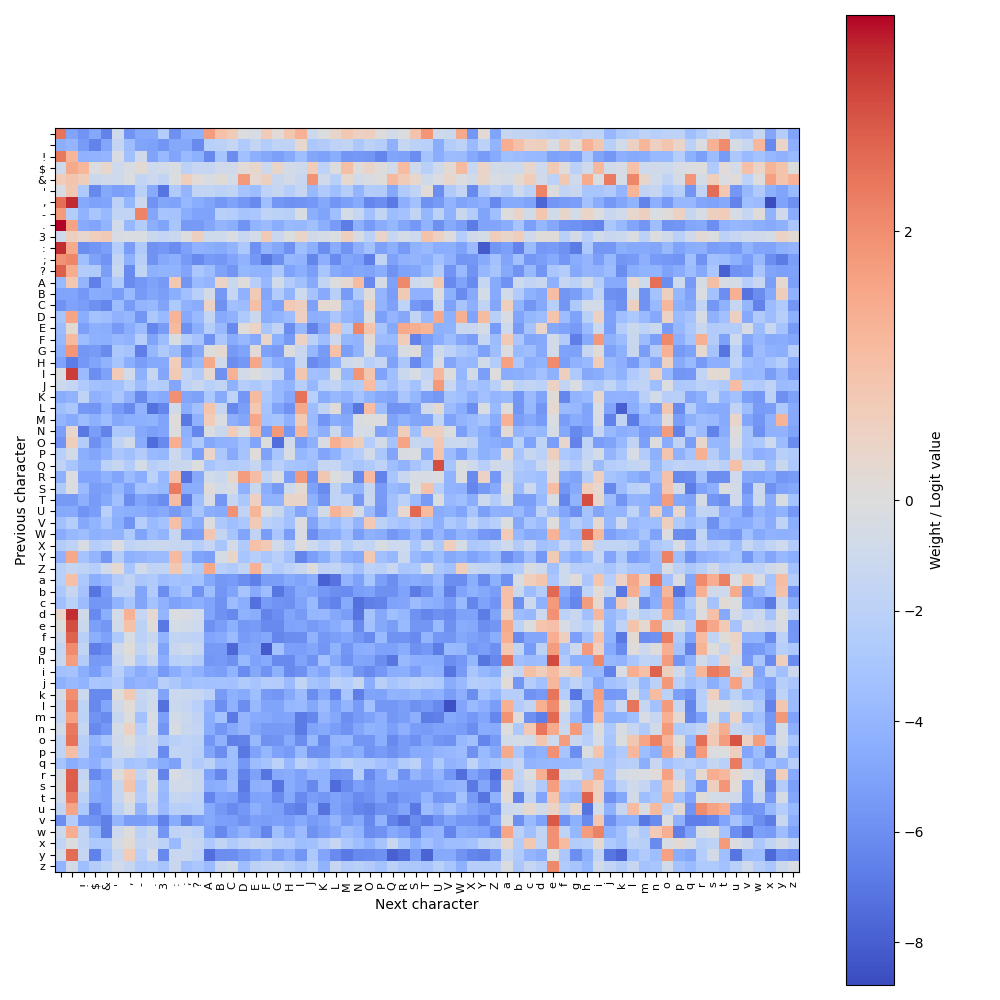

+++
date = '2026-01-05T14:54:19+05:30'
draft = false
title = 'NLP: Part 1 – The Bigram Model'
series = ['nlp']
series_order = 1
+++

Get [the code](https://github.com/tanmaybansal789/nlp_series/tree/main/p1_bigram_model).

## Autocomplete

One common usecase for NLP (*Natural Language Processing*) would be some form of *autocomplete* that allows a user to type more efficiently e.g. on mobile devices.
This could be achieved by looking at the **existing context** and using a model to choose common following characters/words/phrases based on this.
Rather than manually writing out some sort of dictionary which has common phrases to complete with, some sort of *parameter-based model* can be used.

## Planning the model

### Tokens
We need to define what this model is going to **operate** on. 
Ideally, it should be abstracted away from the specific example of English ASCII text.
- this extends this **same model concept** to any method of encoding text
- or to **any other language**
- even to domains **aside from language**, where **predicting the next element** in a sequence is useful.

This abstract idea is usually called a *token* - for our case, this represents some piece of text.
The **collection of all tokens** that the model knows of is called the *vocabulary* of the model.

For example, say that we had tokens for *each lowercase letter* of the alphabet.
- the **vocabulary size** would be `26`.
- the text of each token would be **encoded to a numeric ID** starting from `0`.
    - e.g. `token_encoding_table = { 'a' : 0, 'b' : 1, 'c' : 2 ... }`
- some input consisting **only of these letters** would be converted to an **array of numeric IDs** (or the reverse).
    - e.g. `'hello' -> [7, 4, 11, 11, 14]`

### Bigram model
Now that we have a way to encode/decode input text, we need to train a model to use the existing sequence to produce the next character.
That fact that the existing context can be **variable-length** is one thing that differentiates NLP from other fields, which may have a fixed input size.

Different architectures handle this in different ways, but for a simplistic autocomplete, one thing you could do, is *only look at the previous token* to predict what comes next.
Of course, this means the model is really simple, and loses any sort of coherence when generating long passages, but for autocomplete where the user probably just wants some helpful next completions, this will work fine.

This model is known as a **bigram model**. The only parameters it stores represent how likely it is to see a **certain pair of adjacent tokens**. 
This means that the table that stores this will be `vocab_size * vocab_size` in shape.

In our case, we'll use characters as tokens, although we'll cover more advanced tokenisation schemes in the future.
Assuming 65 characters, depending on what are used in the input data, we'll have `65 * 65 == 4_225` parameters.
With f32 precision, we then only have store about `4_225 * 4 / 10^3 == 16.9KB` worth of data for parameters, which is *essentially nothing*.

## Implementation
Firstly, import necessary modules (we'll be using PyTorch):
```python
import torch
from torch import nn
from torch.nn import functional as F
```

### Encoder
Then, we should define something to help us go from text to tokens, and back.
We'll call this an `Encoder`, and the implementation looks like this:
```python
class Encoder:
    def __init__(self, text):
        self.decoder = sorted(set(text))
        self.encoder = { c : i for i, c in enumerate(self.decoder) }

    def decode(self, l):
        return ''.join(self.decoder[i] for i in l)

    def encode(self, s):
        return [self.encoder[c] for c in s]

    @property
    def n_vocab(self):
        return len(self.decoder)
```

We begin by creating a list of unique characters **sorted by ASCII value**, from the text. 
This represents the *decoder* (takes a token ID as an index, and returns a character).
Then, we can create a dictionary that goes the other way, from **characters to indices**.
```python
self.decoder = sorted(set(text))
self.encoder = { c : i for i, c in enumerate(self.decoder) }
```

`decode()` converts a list of indices to a string:
```python
def decode(self, l):
    return ''.join(self.decoder[i] for i in l)
```

`encode()` converts a string to a list of indices:
```python
def encode(self, s):
    return [self.encoder[c] for c in s]
```
We also define a property (that can be referenced like `encoder.n_vocab`) which defines the vocabulary size as the number of elements in the decoder.

### Data processing
For this project, we'll load all our data from a single, large text file. 
Here, I'll use the [Tiny Shakespeare](https://raw.githubusercontent.com/karpathy/char-rnn/master/data/tinyshakespeare/input.txt) dataset from Karpathy.


Having saved the 'input.txt' file:
```python
text = open('input.txt').read()
encoder = Encoder(text)
data = torch.tensor(encoder.encode(text), dtype=torch.long)
```

We can look at a preview of the encoder and input data as follows:
```python
print('Encoder vocabulary size:', encoder.n_vocab)
print('Characters in encoder:', ''.join(encoder.decoder))
print('Number of tokens in data:', len(data))
print('-' * 50)
print(text[:100])
print(data[:100])
```
```
Encoder vocabulary size: 65
Characters in encoder: 
 !$&',-.3:;?ABCDEFGHIJKLMNOPQRSTUVWXYZabcdefghijklmnopqrstuvwxyz
Number of tokens in data: 1115393
--------------------------------------------------
First Citizen:
Before we proceed any further, hear me speak.

All:
Speak, speak.

First Citizen:
You
tensor([18, 47, 56, 57, 58,  1, 15, 47, 58, 47, 64, 43, 52, 10,  0, 14, 43, 44,
        53, 56, 43,  1, 61, 43,  1, 54, 56, 53, 41, 43, 43, 42,  1, 39, 52, 63,
         1, 44, 59, 56, 58, 46, 43, 56,  6,  1, 46, 43, 39, 56,  1, 51, 43,  1,
        57, 54, 43, 39, 49,  8,  0,  0, 13, 50, 50, 10,  0, 31, 54, 43, 39, 49,
         6,  1, 57, 54, 43, 39, 49,  8,  0,  0, 18, 47, 56, 57, 58,  1, 15, 47,
        58, 47, 64, 43, 52, 10,  0, 37, 53, 59])
```
You can see some sort of dialogue here, and the relevant token encoding.
Here, you can tell that spaces are encoded as `1` and newlines encoded as `0`.

We'll need to load data for training and validation.

Using this function, 70% of the tokens are allocated for training, and 30% for validation.
```python
def train_val_split(data, train_frac):
    i = int(len(data) * train_frac)
    return data[:i], data[i:]

train_data, val_data = train_val_split(data, 0.7)
```

In each batch of training data, we'll load `batch_size` different sequences randomly, each of length `block_size`. 
```python
# batch training data
def get_batch(data, block_size, batch_size):
    # random offsets into the training data
    ix = torch.randint(len(data) - block_size, (batch_size,))
    # input
    xb = torch.stack([data[i : i + block_size] for i in ix])
    # offset by 1 because each token should predict the next one in the sequence
    yb = torch.stack([data[i + 1 : i + block_size + 1] for i in ix])
    return xb, yb
```

### Model implementation
With this, we can implement the actual `BigramModel` as an `nn.Module`:
```python
class BigramModel(nn.Module):
```

This constructor initialises an `nn.Embedding` module which essentially stores one row of logits of size `vocab_size`, per token. It also sets up the block size (not important for a bigram model - we use it in the training loop, but will be useful later).
The logit `i` is related to the probability of next predicting the token `i` (they must be scaled by softmax to make all positive and sum to 1).
```python
    def __init__(self, vocab_size, max_block_size=8):
        super().__init__()
        self.embed = nn.Embedding(vocab_size, vocab_size)
        self.block_size = max_block_size
```

Next, we create the `forward()` function that takes in a tensor of token indices, shape `(B, T)` where `B` is the **batch dimension**, and `T` is the **time dimension** (*how many tokens are being processed*).
It returns the relevant logits, of shape `(B, T, vocab_size)` (the new dimension since we need to get a row of logits for each token index).
```python
    def forward(self, idx):
        logits = self.embed(idx)
        return logits
```

We can also implement the generation loop that uses the model to extend the `idx` by `n_toks` in the time dimension (new shape `(B, T + n_toks)`)

```python
   def generate(self, idx, n_toks=500):
        for _ in range(n_toks):
            logits = self(idx)
            # only get the last elements in the time dimension
            logits = logits[:, -1, :]
            # softmax across channel dimension - for bigram, vocab_size == C
            probs = F.softmax(logits, dim=-1)
            # 1 random sample using this generated probability distribution
            idx_next = torch.multinomial(probs, 1)
            # concatenate on the time dimension
            idx = torch.cat((idx, idx_next), dim=1)

        return idx
```

The generation loop is pretty simple:
1. Predict logits on the current context. `(B, T) -> (B, T, C)`
2. Extract the last row of logits for each batch. `(B, T, C) -> (B, C)`
3. Perform softmax on each row of logits to get a probability distribution. `(B, C) -> (B, C) (but now softmaxxed)`
4. Randomly sample from the probability distribution to get a next token. `(B, C) -> (B)`
5. Concatenate to the current context. `(B, T) -> (B, T + 1)`
6. Repeat up to `n_toks` times.

Of course, this isn't the most efficient implementation - we run `forward()` on the entirety of `idx` even though we only needed it on the last row.
We could pass in `idx[:, -1:]` but as you'll see later, more complex models consider the entire context, so this generation loop will mirror those better.

That was the entirety of the Bigram model! As you can see, this is an incredibly simple model - however it has similarities to the *core generation and training loop* seen in modern NLP.

## Training loop
We now have to implement a training loop that:
- creates an **optimiser** (a PyTorch object that handles updating parameters based on gradients)
- creates a **loss function/criterion** (we will be using cross-entropy, which measures the difference between the predicted probability, and the *one-hot encoded vector* of the actual following token).
- runs a training loop that:
    - **uses** the functions from before to get a **batch of features and labels**
    - **passes** the features into the model and get the output logits
    - **combines** the batch and time dimensions (of both the logits and labels) because of how PyTorch works
    - **evaluates** the criterion on the logits and labels
    - **backpropagates** to get the gradients for the parameters 
    - **steps** the optimiser

The training loop looks like this:
```python
def train_bigram(model, train_data, batch_size=32, n_steps=10000):
    optimiser = torch.optim.Adam(model.parameters())
    criterion = nn.CrossEntropyLoss()

    for step in range(n_steps):
        xb, yb = get_batch(train_data, model.block_size, batch_size)

        logits = model(xb)
        B, T, C = logits.shape # (batch size, time dimension, channel)

        logits = logits.view(B*T, C)
        yb = yb.view(B*T)

        loss = criterion(logits, yb)

        optimiser.zero_grad()
        loss.backward()
        optimiser.step()

        if step % 1000 == 0:
            print(f'{step}: loss={loss.item()}')
```

Okay, so now the training loop is ready, all that is left is to create the model and call it.
```python
model = BigramModel(len(encoder.decoder))
train_bigram(model, train_data)
```

We can see the output of the training as below:
```
0: loss=4.515476703643799
1000: loss=3.621716022491455
2000: loss=3.058687925338745
3000: loss=2.79154372215271
4000: loss=2.646205425262451
5000: loss=2.5401711463928223
6000: loss=2.548767566680908
7000: loss=2.5454893112182617
8000: loss=2.3823819160461426
9000: loss=2.3575167655944824
```

The result slowly dropped and stagnated at ~2.4.
In other words, on average, 2.4 bits are required by our model to encode the next character, given the current one.
In other other words, on average, `2 ** 2.4` or roughly 5.3 different choices of next character are treated as equally likely options by our model.

A model that knew nothing would require `log2(65)` or roughly 6.0 bits to encode the next character.
Then, we've compressed this by `6.0 / 2.4` or roughly **2.5X**! Even our very simple model is already picking up on common patterns in text.

We can generate some output as follows:
```python
print(encoder.decode((model.generate(torch.zeros((1, 1), dtype=torch.long)).tolist())[0]))
```
```
HAl o, a t lp;

KETheswet uchavute;
OLAD girinsedo itle mure s s tlowelanshe thtlevelly, dre ouct indS:
Angrs mue e.
O:
Fono fan pit ghing Anyoes wncalieenongr:
ARIs.
bUS: trsthanee bristheare! lopersernthoollleldere drdnoal s m heas?Lonowhin ato youg saitou br.
BExinghor:
T:
Motumad!
Chenot e, hesesha htnd ionsiefrthtimas d akewhe Yonoprmeat thol ton GAs

Wheeshep I'ps, Winghe vece dis
l'sto TI sond goue hemet meen.

NEYe ns win h t o wintink lougs f? d y aisit d sthu w,
FORESThor
Se ale Re'Agl
```

Of course, the output is garbled nonsense, but still - it definitely *resembles English* more than a random string of characters, which is impressive in of itself.

## Visualisation
In fact, we can even look at all of the weights used by this model - note that this is for my **specific initial random weights and random training samples**, your weights may look different...


You may notice that there is a *very negative* square between lowercase characters being followed with uppercase characters, which makes sense.
Some other notable hotspots include:
```
Lowest weighted pairs
#1: (',', 'x')
#2: ('l', 'V')
#3: ('g', 'F')
#4: (':', 'Y')
#5: ('L', 'k')
#6: ('?', 't')
#7: ('y', 'Q')
#8: ('a', 'K')
#9: ('y', 'T')
#10: (',', 'd')
#11: ('y', 'k')
#12: ('g', 'C')
#13: ('y', 'x')
#14: ('s', 'L')
#15: ('O', '.')
#16: ('r', 'W')
#17: ('r', 'Z')
#18: ('O', 'G')
#19: ('y', 'R')

Highest weighted pairs
#1: ('.', '\n')
#2: (',', ' ')
#3: (':', '\n')
#4: ('d', ' ')
#5: ('I', ' ')
#6: ('h', 'e')
#7: ('e', ' ')
#8: ('Q', 'U')
#9: ('T', 'h')
#10: ('o', 'u')
#11: ('v', 'e')
#12: ('s', ' ')
#13: ('r', ' ')
#14: ('?', '\n')
#15: ('i', 'n')
#16: ('r', 'e')
#17: ('f', ' ')
#18: ('t', 'h')
#19: ('W', 'h')
```

The model has **learnt common structures** within the text, for example the use of `':'` followed by `'\n'`, which is how the character that is currently speaking is denoted. Of course, punctuation being followed by whitespace is also seen here, along with 'Q' followed by 'U' (even if the combination is rarer, Q is seen mostly in that configuration).
