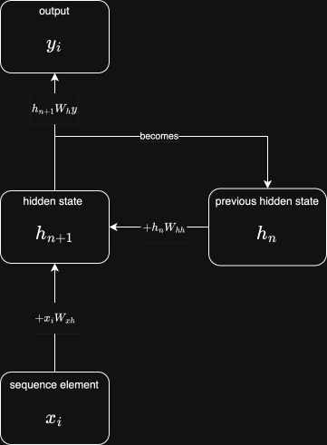

+++
date = '2026-05-31T17:02:31+01:00'
draft = false
title = 'NLP: Part 3 - The Recurrent Neural Network (RNN)'
series = ['nlp']
series_order = 3
math = true
+++

## What next?
Having explored simple feedforward neural networks in the context of NLP, we now turn our attention to a marginally more complex architecture: the **recurrent neural network**.
Unlike models where we had to use hacks like concatenating word vectors in sliding windows to get a fixed-length input, RNNs are *built with sequences in mind*, so are well-suited to NLP tasks.

## The idea
Th underpinning idea behind RNNs is to pass in each item of the sequence one at a time, all while maintaining a *hidden state* updated after processing each item.
This hidden state captures the relevant information seen so far, allowing the model to make informed predictions based on the entire sequence up to that point.
As before, each element in the sequence (and the hidden state) are represented as vectors. 3 linear projection matrices are used:
- `W_xh` - project **input** to **hidden state**
- `W_hh` - project previous **hidden state** to contribution to new **hidden state**
- `W_hy` - project **hidden state** to **output**.



## The math
The RNN cell can be expressed mathematically as follows:
\[
    h_t = \sigma(x_t W_{xh} + h_{t-1} W_{hh}) \\
    y_t = h_t W_{hy}
\]

## Implementation

```python
import torch
from torch import nn
from torch.nn import functional as F

device = torch.device('cuda' if torch.cuda.is_available() else 'mps' if torch.backends.mps.is_available() else 'cpu')

# text <-> tokens
class Encoder:
    def __init__(self, text):
        self.decoder = sorted(set(text))
        self.encoder = { c : i for i, c in enumerate(self.decoder) }

    def decode(self, l):
        return ''.join(self.decoder[i] for i in l)

    def encode(self, s):
        return [self.encoder[c] for c in s]

    @property
    def n_vocab(self):
        return len(self.decoder)

# split training/validation data
def train_val_split(data, train_frac):
    i = int(len(data) * train_frac)
    return data[:i], data[i:]

# batch training data
def get_batch(data, block_size, batch_size):
    ix = torch.randint(len(data) - block_size, (batch_size,))
    xb = torch.stack([data[i : i + block_size] for i in ix]).to(device)
    yb = torch.stack([data[i + 1 : i + block_size + 1] for i in ix]).to(device)
    return xb, yb

class RNNCell(nn.Module):
    """An RNN cell for processing the input at each time step."""
    def __init__(self, input_size, hidden_size, output_size):
        super().__init__()

        # Weights for input to hidden state transformation
        self.W_xh = nn.Linear(input_size, hidden_size)
        # Weights handling contribution of previous hidden state to the next hidden state
        self.W_hh = nn.Linear(hidden_size, hidden_size)
        # Weights for hidden state to output transformation
        self.W_hy = nn.Linear(hidden_size, output_size)

    def forward(self, x, h):
        # Compute the next hidden state
        h_next = torch.tanh(self.W_xh(x) + self.W_hh(h))
        # Compute the output
        y = self.W_hy(h_next)

        return y, h_next

class RNNModel(nn.Module):
    """The RNN model wrapping the RNN cell and embedding layer to provide a complete language model."""
    def __init__(self, vocab_size, embed_dim, hidden_size):
        super().__init__()
        self.embed = nn.Embedding(vocab_size, embed_dim)
        self.rnn_cell = RNNCell(embed_dim, hidden_size, vocab_size)

    def forward(self, idx):
        # idx is of shape (B, T)
        B, T = idx.shape
        # Embed the input tokens
        x = self.embed(idx)  # (B, T, E)

        # Initialise hidden state to zeros
        h = torch.zeros(B, self.rnn_cell.W_hh.out_features, device=x.device)

        # Process the sequence through the RNN cell
        outputs = []
        for t in range(T):
            # Provide the input for the current time step of shape (B, E)
            y, h = self.rnn_cell(x[:, t, :], h)
            outputs.append(y)

        # Stack outputs to get (B, T, vocab_size) logits - one per time step
        logits = torch.stack(outputs, dim=1)
        return logits

    def generate(self, idx, n_toks=500):
        # idx is of shape (B, T)
        B, T = idx.shape
        # Embed the input tokens
        x = self.embed(idx)  # (B, T, E)

        # Initialise hidden state to zeros
        h = torch.zeros(B, self.rnn_cell.W_hh.out_features, device=x.device)

        # Process the initial sequence through the RNN cell to build the necessary hidden state
        for t in range(T):
            _, h = self.rnn_cell(x[:, t, :], h)

        # Instead of using forward(), we will use the RNN cell directly to not have to rebuild the hidden state from the start of the sequence each time.
        for _ in range(n_toks):
            # Get the logits for this timestep from the current hidden state
            y = self.rnn_cell.W_hy(h)
            # Convert logits to probabilities using softmax
            probs = F.softmax(y, dim=1)
            # Sample the next token from the probability distribution
            idx_next = torch.multinomial(probs, 1)  # (B, 1)
            # Embed the sampled token to get input for the next time step
            x_next = self.embed(idx_next.squeeze(1))  # (B, E)
            # Update hidden state based on the new input and current hidden state
            _, h = self.rnn_cell(x_next, h)
            # Append the generated token to the sequence
            idx = torch.cat((idx, idx_next), dim=1)

        return idx

# training loop
def train_rnn(model, train_data, batch_size=32, n_steps=10_000, seq_len=64):
    optimiser = torch.optim.Adam(model.parameters())
    criterion = nn.CrossEntropyLoss()

    for step in range(n_steps):
        xb, yb = get_batch(train_data, seq_len, batch_size)

        logits = model(xb)
        # (B, T, vocab_size) -> (B * T, vocab_size) and (B, T) -> (B * T)
        # in other words, contract the time dimension into the batch dimension so that we compute loss over all batches over all time steps at once.
        # this means we don't have to explicitly loop over time step prefixes here.
        loss = criterion(logits.view(-1, logits.size(-1)), yb.view(-1))
        optimiser.zero_grad()
        loss.backward()
        optimiser.step()

        if step % 100 == 0:
            print(f'{step}: loss={loss.item()}')

if __name__ == "__main__":
    # load text and build encoder
    should_train = False
    
    input_path = 'p3_rnn_model/input.txt'
    model_path = 'p3_rnn_model/rnn_model.pt'

    text = open(input_path).read()
    encoder = Encoder(text)

    data = torch.tensor(encoder.encode(text), dtype=torch.long).to(device)
    train_data, val_data = train_val_split(data, 0.9)

    model = RNNModel(encoder.n_vocab, embed_dim=64, hidden_size=128).to(device)
    if should_train:
        train_rnn(model, train_data, batch_size=32, n_steps=10_000)
        torch.save(model.state_dict(), model_path)
    else:
        model.load_state_dict(torch.load(model_path, map_location=device))
        model.to(device)
        model.eval()

    print(encoder.decode((model.generate(torch.tensor([encoder.encode('First Citizen:')], dtype=torch.long).to(device), n_toks=1000)[0].tolist())))
```

Running this code will train an RNN model on the input text and generate a sequence of text based on the learned patterns. The model can be trained or loaded from a saved state, depending on the `should_train` flag.


The typical output of the model after training might look like this:
```
First Citizen:
That then,
Marry
Of a good and second of
Were gods to should then hate's heaving to fousher in itanns must's goved in thy grans unto live.

QUEEN:
Marroose seems Paultry's even my loving succhise by the inery tears Angease;
For ervess! when not but thou tent. Helphe,
His than mysa of my very the swear,
Away,
If that whils encolter noble worse?

CWeltI:
Prilive the grace.

MENENIUS:
Come, fles'd it implearth!

ENBRLOUC:
Come.
They must say in your helf it not to the house on Edward's father,
And
sin;
Dively ten?

SICINIUS:
Marry of a givenge a court:
Com'd past harn among Right, wenger nurse 'twill for I state?

KING DICHIS:
Ala. Have take my fee on you a gook wear'ld thad trivine breel!
Come him faited from York at you such not to take thee than, I would by widether counter
And gentlemen buits it with a kinging than's noble his servinged to younber, Dastion!--

KING EDWARD IV:
Talks in; we alies of hope crown,
Tenust then here you thy from discours her to to came so fortune ible warra
```
Compared to the N-gram models from before, there is a noticeable improvement - clearly, the RNN is capable of stringing together much more plausible combinations of letters to form words, but there is still little in the way of a narrative. This makes sense - as sequences are passed through the RNN, the **hidden state acts as a bottleneck** - information from earlier timesteps gets lost, exacerbated by vanishing gradients.

There are techniques to remedy this - LSTMs and GRUs used gates to control the flow of information, but at their core, they still rely on the RNN architecture.